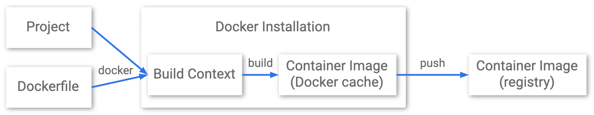
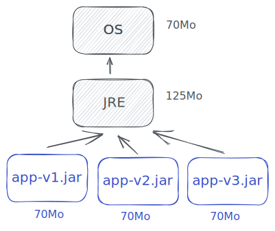
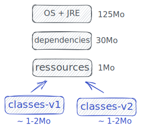

<style>
img[alt~="center"] {
  display: block;
  margin: 0 auto;
}
</style>
# Construire nos images Java sans Docker

---
# Sommaire

1. Introduction 
2. Les bonnes pratiques
3. JIB
4. Alternatives

---
## Intro - Processus



- Dockerfile
- Installation Docker

--- 
## Intro - Dockerfile

```dockerfile
FROM openjdk:17-jdk-alpine

MAINTAINER miguel.ortega@jesuisundev.sh

COPY target/myMegaApp.jar
ENTRYPOINT ["java","-jar","/myMegaApp.jar"]
```

- quid de la sécurité ?
- quid du layering ?
- options de la jvm ?


--- 


- Chaque changement embarque tout (même si on a changé une ligne de code)
- Coût network, disque, temps !


--- 
# Meilleure approche

```dockerfile
FROM eclipse-temurin:11-jre

# Multiple copy statements are used to break the app into layers,
# allowing for faster rebuilds after small changes
COPY dependencyJars /app/libs
COPY resources /app/resources
COPY classFiles /app/classes

ENTRYPOINT ["java", "$JVM_OPTIONS", "-cp", "/app/resources:/app/classes:/app/libs/*","com.example.Main.class"]
CMD ["--some-args"]
```

- un layer pour nos dépendances 
- un layer pour nos ressources 
- un layer pour nos classes project
- un entry point custom

--- 


- On réutilise plus souvent le "cache"
- Reduction du "prix" network, disque, temps

---

- Un bon Dockerfile, pas une mince affaire !
- On a toujours besoin d'un env Docker (pénible des fois pour un env de CI/CD)

Du coup :

- Pas de panique l'outillage émerge :)
- Exemple:
  - Kaniko (dockerfile ☑, docker ⛔, _multi stacks_)
  - JIB (dockerfile ⛔, docker ⛔, _java only_)
  - Buildpacks, pack (dockerfile ⛔, docker ☑, _multi stacks_)

---
## JIB


- Pas besoin de docker
- pas besoin de Dockerfile
- Pas d'image locale, publication directe
  - configurable
- Plugin maven, gradle

---
## JIB Maven Plugin

```xml
<project>
  <build>
    <plugins>
      <plugin>
        <groupId>com.google.cloud.tools</groupId>
        <artifactId>jib-maven-plugin</artifactId>
        <version>3.2.1</version>
        <configuration>
          <to>
            <image>myimage</image>
          </to>
        </configuration>
      </plugin>
    </plugins>
  </build>
</project>
```

---
## JIB Maven Plugin

```bash
mvn compile jib:build
```

- Configurations:
  - base images 
  - main class
  - jvm options
- Push vers tous les registry: artifactory, gcp, aws, ...
- On peut lier cette commande à une phase maven (_e.g. `deploy`_)
---
## JIB - Equivalent

```dockerfile
# Jib uses Adoptium Eclipse Temurin (formerly AdoptOpenJDK).
FROM eclipse-temurin:11-jre

# Multiple copy statements are used to break the app into layers,
# allowing for faster rebuilds after small changes
COPY dependencyJars /app/libs
COPY snapshotDependencyJars /app/libs
COPY projectDependencyJars /app/libs
COPY resources /app/resources
COPY classFiles /app/classes

# Jib's extra directory ("src/main/jib" by default) is used to add extra, non-classpath files
COPY src/main/jib /

# Jib's default entrypoint when container.entrypoint is not set
ENTRYPOINT ["java", jib.container.jvmFlags, "-cp", "/app/resources:/app/classes:/app/libs/*", jib.container.mainClass]
CMD [jib.container.args]
```