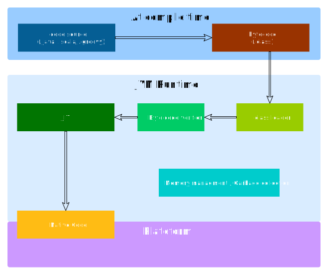
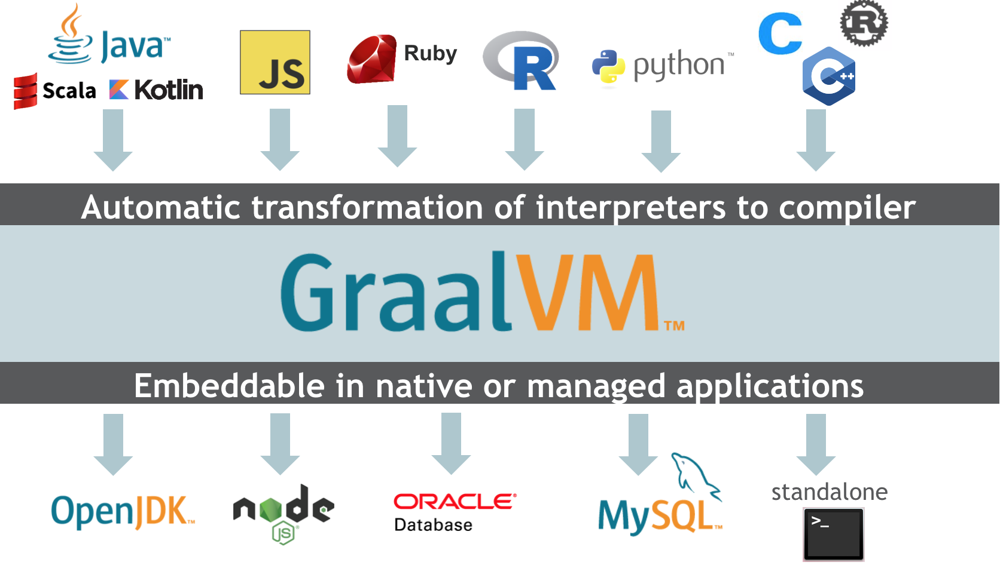
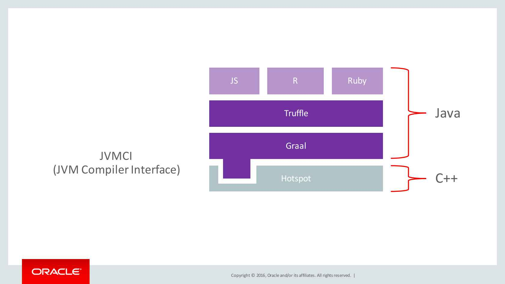
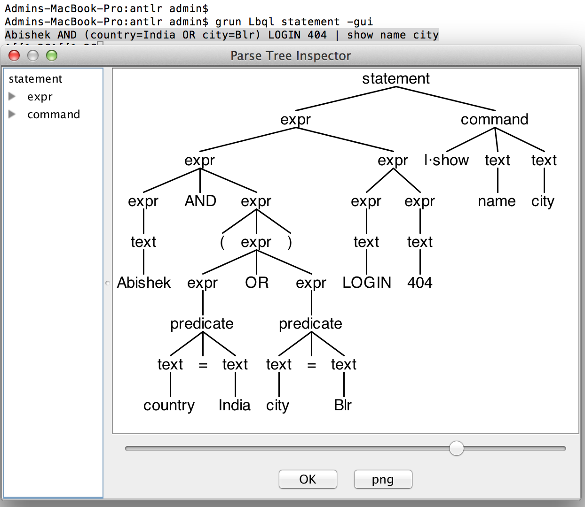
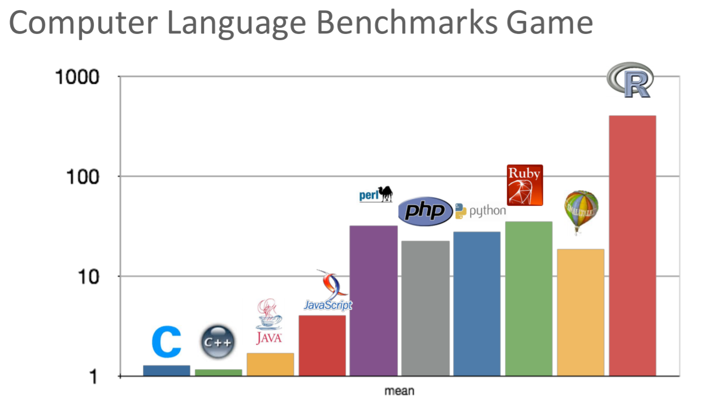
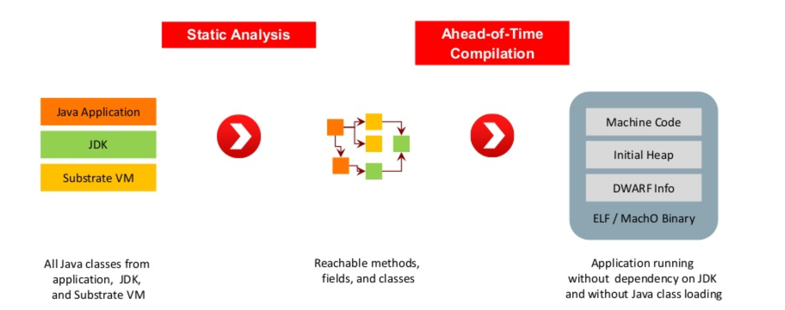
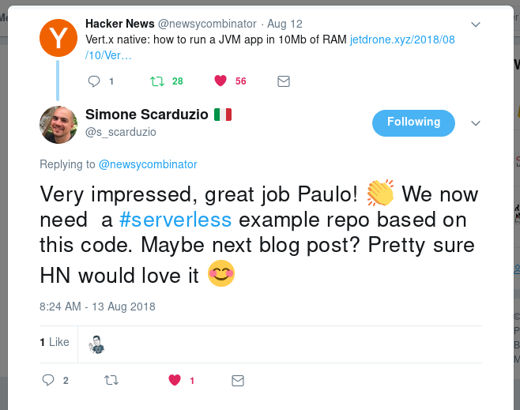

<style>
img[alt~="center"] {
  display: block;
  margin: 0 auto;
}
</style>
# A la découverte de Graal VM

## 🏆

_2019-01_

---
# Sommaire

1. Rappel: la JVM
2. Graal VM: Introduction
3. Graal VM: JIT Compiler
4. Graal VM: Polyglot API
5. Graal VM: Native Image

<!-- 
Pourquoi cett présentation?

- Beaucoup d'information éparpillée sur le net
- Suite à une travail de consolidation, autant partager ces informations

Tout d'abord, on présentera très succcintement la JVM, afin de mieux comprendre
les différences avec GraalVM.

Dans un deuxième partie, on présentera les fonctionnalités nouvelles/complémentaires apportés par GraalVM
-->

---
## Cycle de vie de l'execution d'une application



<!--
à la compilation:

- Lecture du fichier source, n'importe quel language compatible avec la JVM (java, scala, kotlin, groovy)
- Suite à la phase de compilation on se retrouve avec du byte code qui peut être ensuite executé par une JVM

au runtime:

Le bytecode va être:

- Chargé
- Vérifié pour s'assurer que le bytecode est compatible
- Interprété puis transformer en instructions compréhensible par la plateforme cible (Windows, Linux, Mac OS)

L'intérprétation du bytecode rend l'execution du programme plus lent.
Le fonction du just-in_time compiler et d'améliorer les performances de l'application,
en passant une deuxième phase de compilation au runtime, en compilant et optimizant le bytecode
en language machine.

Par l'intérmédiaire du JIT, la plateforme va executer directement les instructions issues du JIT, plutôt que
ré-interpretér le bytecode.
-->

---
# Plus d'infos

- https://www.javaworld.com/article/2078623/core-java-jvm-performance-optimization-part-1-a-jvm-technology-primer.html
- https://www.javaworld.com/article/2078635/jvm-performance-optimization-part-2-compilers.html

---
# JVM FTW

* performance
* "write once run everywhere"

Mais ...

* startup "lent"
* usage procésseur, mémoire, disque

---
## Enter GraalVM



<!--
Les promesses de GraalVM sont les suivantes:

- L'intérprétation et l'éxecution d'une variété de language , en plus de ceux inclus dans la JVM: js, ruby, python, etc...
- L'interopérabilité de ces languages
- Tout cela, sur une variété de moteurs d'execution: il inclut une JVM, mais un aussi un moteur javascript (complétement compatible avec nodejs)
- On peut même embarquer graalvm dans une base de donnée compatible (usage? PL/SQL en java/python?)


Le but affiché: Fournir une plateform et des outils hautement performant, language-agnostic
-->

---
# Graal as JIT Compiler #1

* Les JIT de la JVM (C1, C2) sont écrits en C++
  * Ancien et complexe
  * Difficile à appréhender et à faire évoluer
  * Sans majeur optimization depuis quelques années
* JVM compiler interface (JVMCI) - [JEP-243](https://bugs.openjdk.java.net/browse/JDK-8062493) - Depuis Java 9

---
# Graal as JIT Compiler #2

* Graal écrit en Java
  * Plus simple à appréhender
  * Architecture modulaire
  * Permet d'apporter des meilleures performances

---
# Graal as JIT Compiler - Applications

- Twitter: améliorer les performances de leur système [source](https://www.youtube.com/watch?v=pR5NDkIZBOA)
  - Moins de GC (2%)
    - Moins de CPU (11%)
- Dev Scala: améliorer les performances de la compilation [source](https://medium.com/graalvm/compiling-scala-faster-with-graalvm-86c5c0857fa3)
  - Moins de tempsde compilation (30%)

---
# Graal as Polyglot VM #1

Graal Polyglot API permet d'embarquer et executer du code d'autres languages dans des applications JVM

```java
import org.graalvm.polyglot.*;
import org.graalvm.polyglot.proxy.*;

public class HelloPolyglot {
  public static void main(String[] args) {
    System.out.println("Hello Java!");
    Context context = Context.create();
    context.eval("js", "print('Hello JavaScript!');");
  }
}
```

---
# Graal as Polyglot VM #2

```javascript
const express = require('express');
const app = express();
app.listen(3000);

app.get('/', function(req, res) {
  var text = 'Hello World!';
  const BigInteger = Java.type('java.math.BigInteger');
  text += BigInteger.valueOf(2).pow(100).toString(16);
  text += Polyglot.eval('R', 'runif(100)')[0];
  res.send(text);
})
```

---
# Graal as Polyglot VM



<!--
Truffle est un framework pour implémenter des interpréteurs de languages en utilisant de AST simplement  
bibliothèque Open Source permettant de créer des implémentations de langages de programmation.
-->

---
# AST KESAKO



<!--
Un AST - arbre de la syntaxe abstraite - analyseur syntaxique.
Un AST est un arbre dont les nœuds internes sont marqués par des opérateurs et dont les feuilles (ou nœuds externes) représentent des variables ou des constantes.
-->

---
# Graal as Polyglot - Applications

- Utilisation des vastes écosystèmes de libraires
  * On ne réinvente plus la roue, on utilise l'existant
- Un outil pour chaque problème
  * `R` pour la datascience, statistiques
  * `Java` pour l'outillage
  * `Ruby` pour x...
- Sans oublier les performances

---
# Graal as Polyglot - Applications



---
## Plus d'infos

[Graal - Truffle @Infoq](https://www.infoq.com/presentations/graal-trufle)

---
# Graal VM as Native Image

Graal VM permet de faire compilation "Ahead-Of-Time"



---
# Graal VM as Native Image

* Sans classloading - Startup 10-100X
* Sans JIT - Utilisation mémoire réduite
* Sans JVM - Moins de place

---
## Graal VM as Native Image - Applications

- Le cloud (function as a service, images docker, ...)
- Les applications en ligne de commande



---
# Quelques limitations

* C'est très récent (la première Release Candidate date d'Avril 2018)
* Pas de windows :(
* [Limitations à la compilation native](https://github.com/oracle/graal/blob/master/substratevm/LIMITATIONS.md)

---
## Sources JVM

- [J.M. Doudoux - la JVM](https://www.jmdoudoux.fr/java/dej/chap-jvm.htm)
- [Understanding JIT compiler](https://aboullaite.me/understanding-jit-compiler-just-in-time-compiler/)

## Source Graal

- [Le site officiel](https://www.graalvm.org/)
- [GraalVM in 2018](https://medium.com/graalvm/graalvm-in-2018-b5fa7ff3b917)
- [The Graal Frenzy - Julien Ponge](https://medium.com/@jponge/the-graalvm-frenzy-f54257f5932c)

---
# Merci!
  