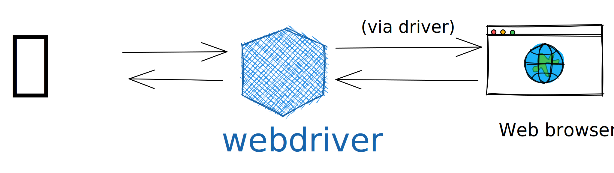
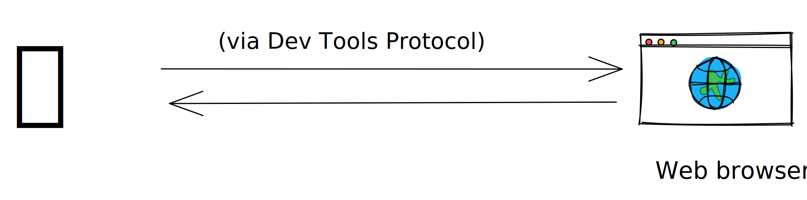
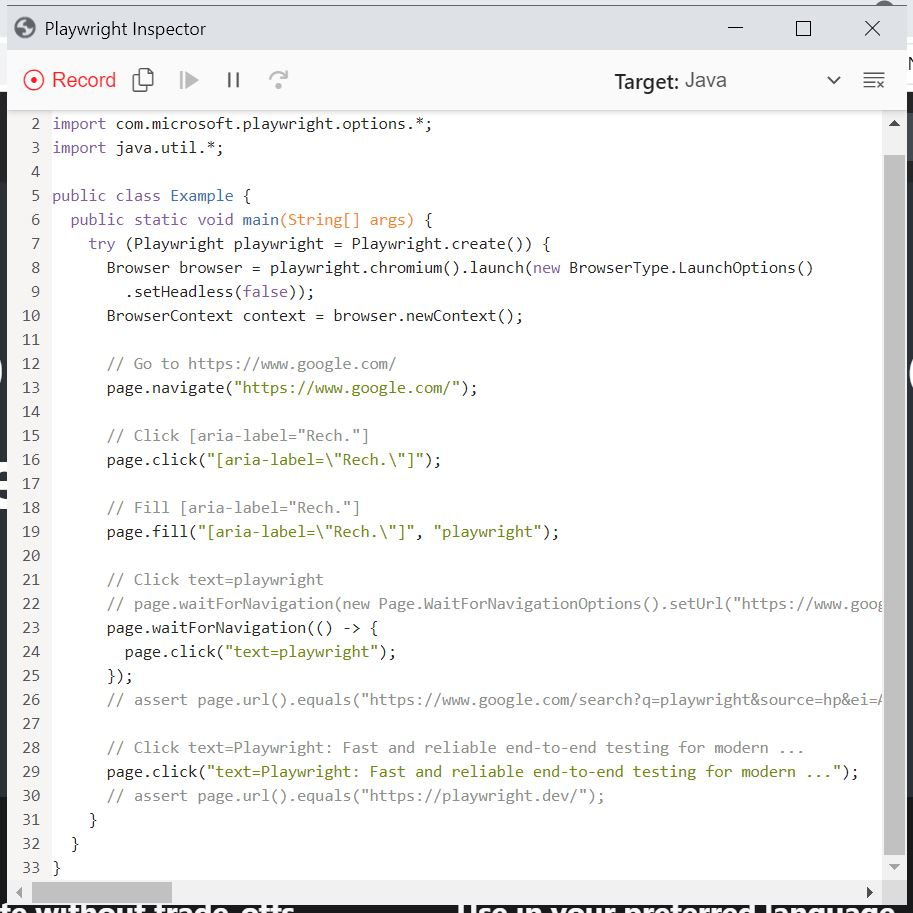

<style>
img[alt~="center"] {
  display: block;
  margin: 0 auto;
}
</style>
# Nouvelle ère de tests E2E avec Playwright

🤖

_2021-11_

---
# Sommaire

1. Intro
2. Webdriver vs DevsTools
3. Playwright
4. Features
5. Démo

---
# Usecase


* Qualifier l'installation d'une application web
  * Tests de non regression
  * Tests acceptance
* Automatiser les "clicks button" sur les écrans

---
## Webdriver




* LE standard (W3C)
* Cross Browser

<!-- Dans l'achitecture classique, le client (node, java, autre) parle au navigateur par l'intermédiaire du webdriver.

Le webdriver interprète les requêtes et se charge de l'envoyer au navigateur.
C'est à ce jour le standard le plus repandu et utilisé par de nombreux framework (cypress, fitness, robot) -->

---
## Webdriver - limitations

Mais:
- Client et Serveur peuvent se désynchroniser (⚠️timing / lenteurs)
- Limitations du webdriver vs le navigateur

_note perso: écrire des tests selenium est une galère..._

---
## Devtools



- Pas de middle man 
- Plus rapide et stable (?) 
- "Limité" par le protocol: géolocation, mobile, network interception, ... 

---
## Devtools - limitations

- Pas "encore" un standard (CDP = Chrome Dev Tools)
  - Tous les navigateurs ne l'implémente pas (ou pas de la même façon)

---
## Playwright


- 1.O.O en 2020
- Développé par Microsoft : https://github.com/microsoft/playwright
  - Ancien équipe en charge de puppeteer 
- Multi-language 
  - typescript principalement 
  - java, python, .Net 
- Se base principalement sur le protocole DevTools 

---
# Playwright - features

* Gestion de scénarios avec multiples pages, domaines, iframe 
* Auto-wait sur les éléments avant d'éxecuter certaines actions (button, input)
* Interception des appels réseaux pour mocker les résultats, voir rédiriger 
* Emulation mobiles, geolocalisation, permissions
* Support de web components (shadow-dom compatible)
* Support du upload / dowload de fichier
* Screenshot, videos, tracing, recorder

---
## Installation

```xml
 <dependency>
  <groupId>com.microsoft.playwright</groupId>
  <artifactId>playwright</artifactId>
  <version>${playwright.version}</version>
</dependency>
```

---
## CodeGen

```powershell
mvn exec:java -e "-Dexec.mainClass=com.microsoft.playwright.CLI" "-Dexec.args=codegen https://google.com"
```
* Ouvre un navigateur en mode privé
* Enregistre tout ce que fait l'utilisateur
* Génère le code correspondant 🔥

---

 

---
# Debug (1/3)

```java
try (Playwright playwright = Playwright.create()) {
  ...
  BrowserContext context = browser.newContext();
  
  // Open new page
  Page page = context.newPage();
  
  page.pause();
  
  // Go to https://www.google.com/
  page.navigate("https://www.google.com/");
}
```
---
# Debug (2/3)

```powershell
set PLAYWRIGHT_JAVA_SRC=<java src root>
set PWDEBUG=1
mvn test
```

* Bien entendu, n'importe quel IDE peu suffire aussi 

---
# Debug (3/3)


---
# Network interception

```java 
// Mock network
page.route("**/api", route -> route.fulfill(
  new Route.FulfillOptions()
  .setStatus(200)
  .setBody("Hello World!")));

page.navigate("https://example.com/api");

assertTrue(page.content().contains("Hello World!"));
```

<!-- Note: Très utile pour
- Tracer/ logguer les appels entrant/sortant
- Intercepter et simuler une réponse
- Cela peut aussi écouter les websockets -->

---
## Screenshots 

```java
page.screenshot(
new Page.ScreenshotOptions()
.setPath(Paths.get("screenshot.png"))
.setFullPage(true));
// ou
byte[] buffer = page.screenshot();
System.out.println(Base64.getEncoder().encode(buffer));
```

<!-- On peut faire aussi un screenshot depuis un élément en fournissant un selecteur -->

---
# Videos

```java
context = browser.newContext(
        new Browser.NewContextOptions().
        setRecordVideoDir(Paths.get("videos/")));
// Make sure to close, so that videos are saved.
        context.close();
```
---
# Tracing (1/2)

```java
Browser browser = browserType.launch();
        BrowserContext context = browser.newContext();

// Start tracing before creating / navigating a page.
        context.tracing().start(new Tracing.StartOptions()
        .setScreenshots(true)
        .setSnapshots(true));

        Page page = context.newPage();
// Do some testing/navigating

// Stop tracing and export it into a zip archive.
        context.tracing().stop( new Tracing.StopOptions()
        .setPath(Paths.get("trace.zip")));
```
---
# Tracing (2/2)

```powershell
mvn exec:java -e "-Dexec.mainClass=com.microsoft.playwright.CLI" "-Dexec.args=show-trace target/trace.zip"
```

Ou mieux, visible directement en ligne:

https://trace.playwright.dev

---
# Reporting

- En cours (typescript seulement)
- Intégration avec Allure

---
# Références

- Playwright:
  - Repo: https://github.com/microsoft/playwright
  - Docs: https://playwright.dev/java/

- Autres:
  - Slides: https://mikomatic.github.io/presentations/playwright.html#/
  - Démo: https://github.com/mikomatic/playwright-demo