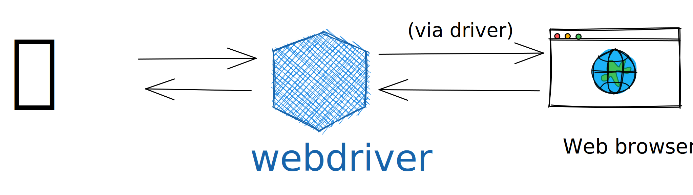
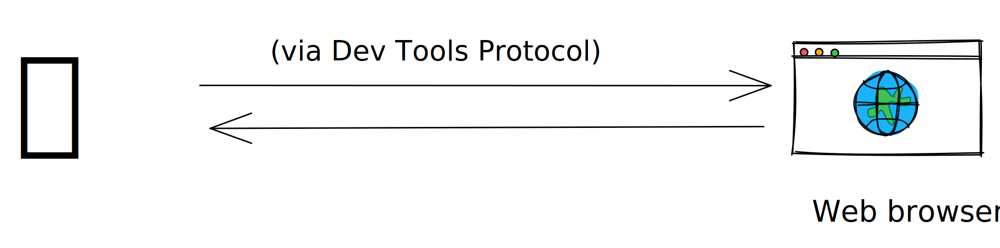
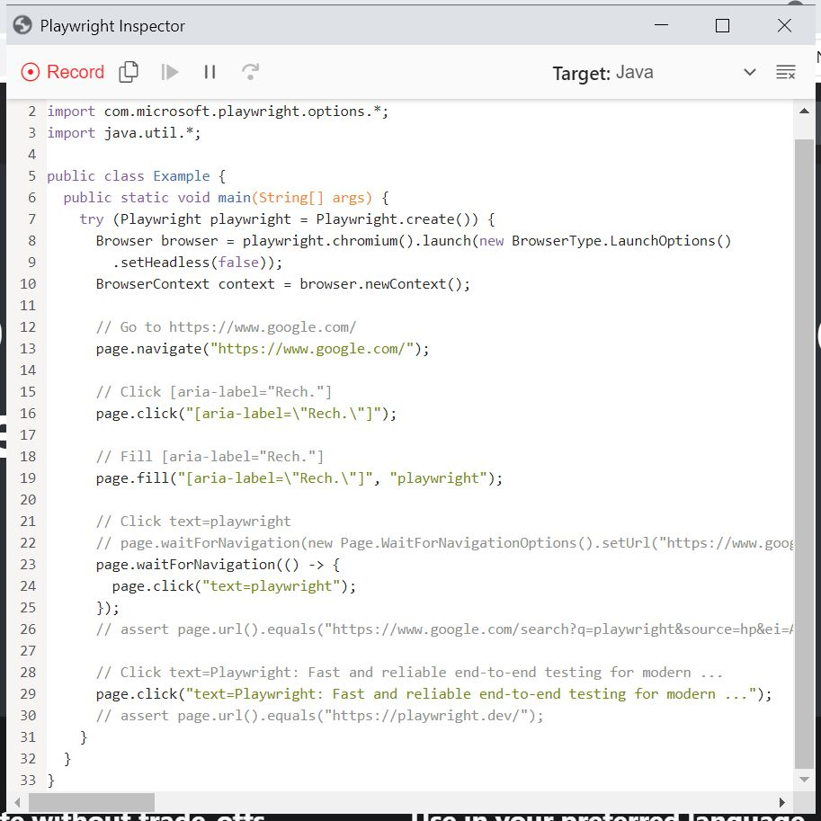
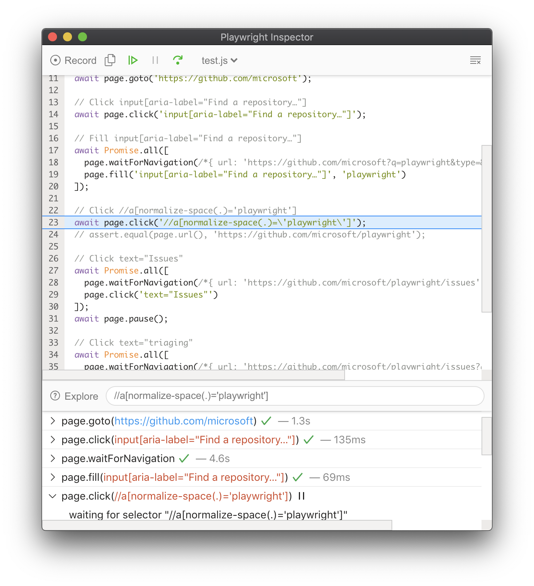

# Nouvelle ère de tests E2E avec Playwright 

🤖

---

1. Intro
2. Webdriver vs DevsTools 
3. Playwright 
4. Features 
5. Démo 

---
## Usecase

----
- Qualifier l'installation d'une application web
  - Tests de non regression
  - Tests acceptance
- Automatiser les "clicks button" sur les écrans

---
## Webdriver

----
 

* LE standard (W3C) <!-- .element: class="fragment" -->
* Cross Browser <!-- .element: class="fragment" -->

Note: Dans l'achitecture classique, le client (node, java, autre) parle au navigateur par l'intermédiaire du webdriver.

Le webdriver interprète les requêtes et se charge de l'envoyer au navigateur.
C'est à ce jour le standard le plus repandu et utilisé par de nombreux framework (cypress, fitness, robot)

----
Mais: 
- Client et Serveur peuvent se désynchroniser (⚠️timing / lenteurs)
- Limitations du webdriver vs le navigateur

_note perso: écrire des tests selenium est une galère..._

---
## Devtools

----
 

- Pas de middle man <!-- .element: class="fragment" -->
- Plus rapide et stable (?) <!-- .element: class="fragment" -->
- "Limité" par le protocol: géolocation, mobile, network interception, ... <!-- .element: class="fragment" -->

Note: tracing, audit, profiler ?

----
Mais:

- Pas "encore" un standard (CDP = Chrome Dev Tools)
  - Tous les navigateurs ne l'implémente pas (ou pas de la même façon)

---
## Playwright
----
- 1.O.O en 2020
- Développé par Microsoft : https://github.com/microsoft/playwright
  - Ancien équipe en charge de puppeteer <!-- .element: class="fragment" -->
- Multi-language <!-- .element: class="fragment" -->
  - typescript principalement <!-- .element: class="fragment" -->
  - java, python, .Net <!-- .element: class="fragment" -->
- Se base principalement sur le protocole DevTools <!-- .element: class="fragment" -->

----

- Gestion de scénarios avec multiples pages, domaines, iframe
- Auto-wait sur les éléments avant d'éxecuter certaines actions (button, input)
- Interception des appels réseaux pour mocker les résultats, voir rédiriger 
- Emulation mobiles, geolocalisation, permissions

----
- Support de web components (shadow-dom compatible)
- Support du upload / dowload de fichier
- Screenshot, videos, tracing, recorder

---

## Installation
----
```xml
 <dependency>
    <groupId>com.microsoft.playwright</groupId>
    <artifactId>playwright</artifactId>
    <version>${playwright.version}</version>
</dependency>
```

---
## Examples / Démos

---
CodeGen
```powershell
mvn exec:java -e "-Dexec.mainClass=com.microsoft.playwright.CLI" "-Dexec.args=codegen https://google.com"
```
- Ouvre un navigateur en mode privé
- Enregistre tout ce que fait l'utilisateur
- Génère le code correspondant 🔥
----
 <!-- .element height="60%" width="60%" -->

---
Debug
```java
try (Playwright playwright = Playwright.create()) {
    ...
  BrowserContext context = browser.newContext();
  
  // Open new page
  Page page = context.newPage();
  
  page.pause();
  
  // Go to https://www.google.com/
  page.navigate("https://www.google.com/");
}
```

----
```powershell
set PLAYWRIGHT_JAVA_SRC=<java src root>
set PWDEBUG=1
mvn test
```

----

 <!-- .element height="60%" width="60%" -->

---
Network interception

```java 
// Mock network
page.route("**/api", route -> route.fulfill(new Route.FulfillOptions().setStatus(200).setBody("Hello World!")));

page.navigate("https://example.com/api");

assertTrue(page.content().contains("Hello World!"));
```

Note: Très utile pour
- Tracer/ logguer les appels entrant/sortant
- Intercepter et simuler une réponse
- Cela peut aussi écouter les websockets

---
## Tracing > Screenshot + Vidéos
mvn 
----