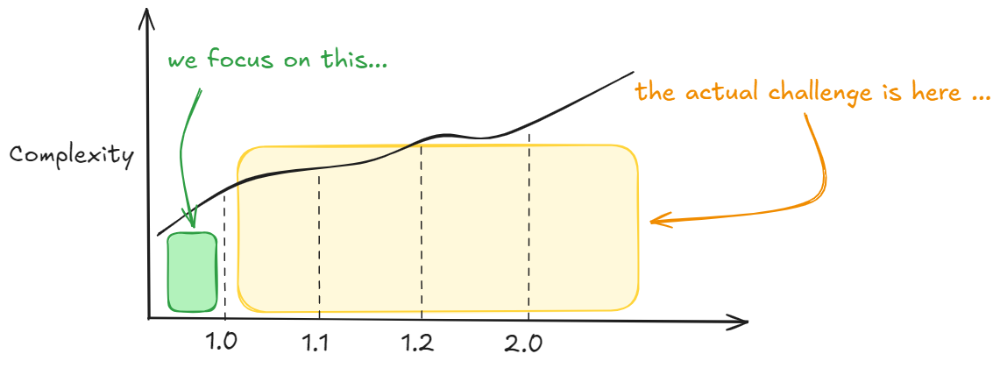
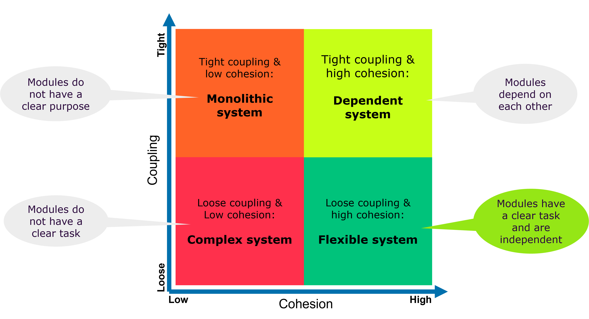
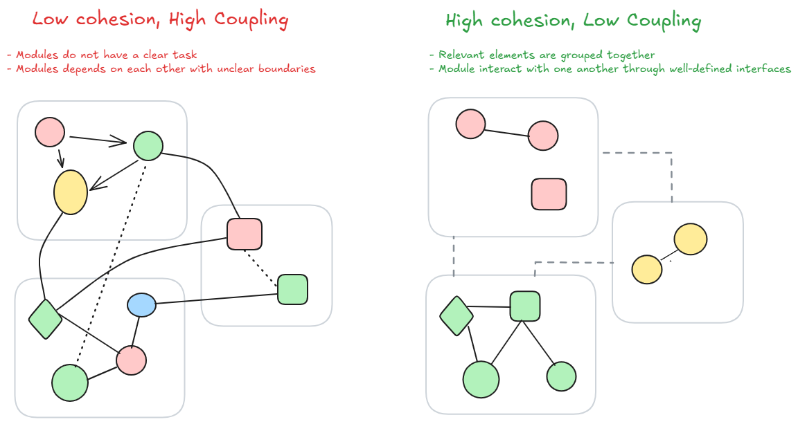

<style>
img[alt~="center"] {
  display: block;
  margin: 0 auto;
}
</style>

# Modular applications with Spring Modulith 🍃

## 🏆

_2025-01_

---

# Sommaire

1. Introduction: Evolving software
2. Clean architecture concepts
3. Spring Modulith : Isolate / Decouple
4. Spring Modulith : Verify
5. Spring Modulith : Test
6. Spring Modulith : Document
7. Spring Modulith: Misc features
8. References

---  

# Software delivery challenge



---  

# Clean archirecture concepts

- **Cohesion**: Cohesion refers to the degree to which the elements within a module, class, or component of a software
  system work together to perform a single, well-defined task.

- **Coupling**: Coupling refers to the degree of interdependence between software modules, classes, or components.
  It measures how much one module relies on another to function correctly.

---  




---  



---

# Spring Modulith: Isolate / Decouple

- Demo Time : 🤓💻

---

# Spring Modulith: Isolate / Decouple

* Leverages Spring's Own Application Event Publisher
* Provides Event persistence (JPA, JDBC, others)
* Provides Externalization abstraction (JMS, AMQP, Kafka)


* ➡️ Opens the architecture to other useful patterns (outbox pattern, CQRS, audit ...)

---

# Spring Modulith: Verify

- Demo Time : 🤓💻

---

# Spring Modulith: Verify

Verification Includes:

- No cycles on the application module level - the dependencies between modules have to form directed, acyclic graph
- Efferent module access via API packages only - references to types that reside in application module internal packages
  are rejected. _configurable_
- Explicitly allowed application module dependencies only (optional) - An application module can optionally define
  allowed dependencies via `@ApplicationModule(allowedDependencies = …)`

---

# Spring Modulith: Test

- Demo Time : 🤓💻

---

# Spring Modulith: Test

- Provides abstractions to bootstrap individual application modules
- Provides abstraction to perform integration test scenarios

```java
// Custom annotation that bootstraps only required module(s)
@ApplicationModuleTest
class SomeApplicationModuleTest {

  @Test
  public void someModuleIntegrationTest(Scenario scenario) {
    // Use the Scenario API to define your integration test
  }
}
```


---

```java
@Test
void testName(Scenario scenario) {
  // Start with an event publication
  scenario.publish(new MyApplicationEvent(…)).…

  // Start with a bean invocation
  scenario.stimulate(() -> someBean.someMethod(…)).…

  // Verification
  // Executes the scenario
  ….toArrive(…)

  // Execute and define assertions on the event received
  ….toArriveAndVerify(event -> …)

  ...andWaitForStateChange(() -> someBean.someMethod(…)))
  .andVerify(result -> …);
}
```

---

# Spring Modulith: Document

- Demo Time : 🤓💻

--- 

# Spring Modulith: There is more

- Observability integration
- Actuator endpoints